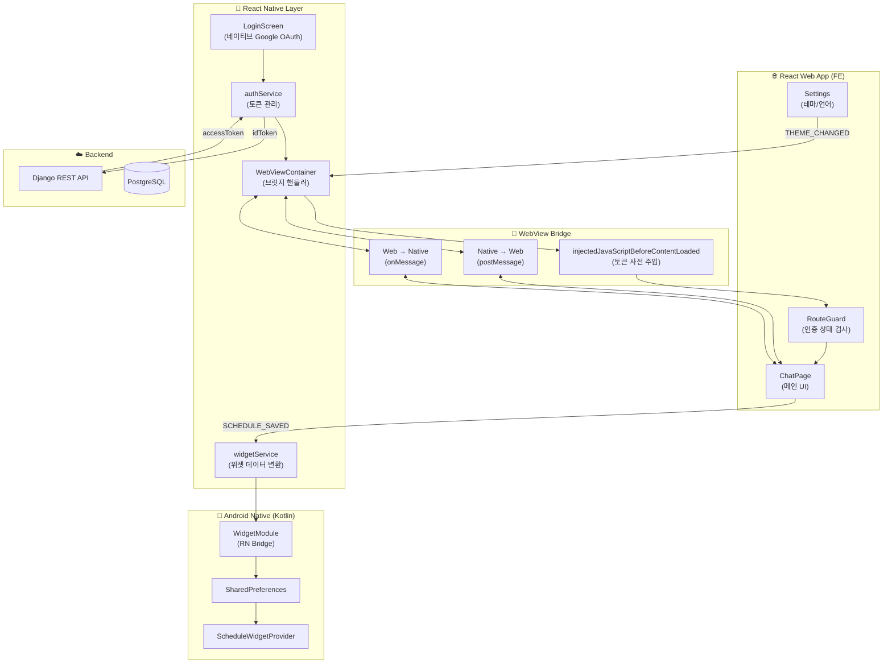
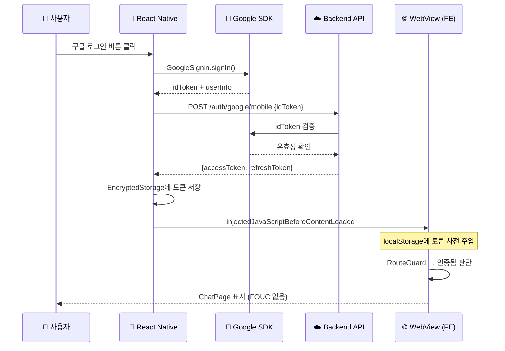
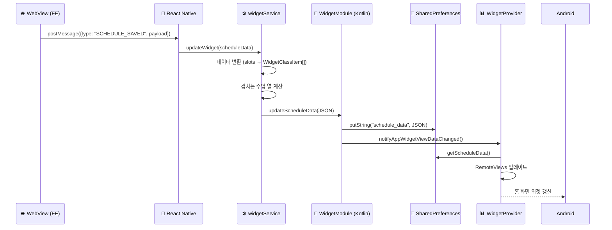
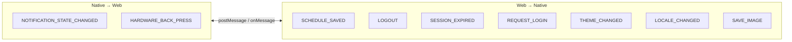

# 아키텍처 다이어그램 (Mermaid)

## 1. 전체 하이브리드 앱 아키텍처

## 2. 인증 플로우 (네이티브 OAuth)

## 3. 위젯 데이터 동기화 플로우

## 4. 양방향 브릿지 메시지 타입

---

## 블로그에 삽입 가이드

| 다이어그램        | 삽입 위치                       | 용도                   |
| ----------------- | ------------------------------- | ---------------------- |
| **전체 아키텍처** | 🔍 아키텍처 선택 섹션 끝        | 하이브리드 구조 시각화 |
| **인증 플로우**   | 💡 해결책 1 (네이티브 OAuth) 앞 | OAuth 흐름 설명        |
| **위젯 동기화**   | 💡 해결책 3 (위젯) 앞           | 데이터 흐름 설명       |
| **브릿지 메시지** | 🔥 도전과제 2 (상태 동기화) 뒤  | 메시지 타입 정리       |

> **참고**: Tistory에서 Mermaid를 직접 렌더링하려면 별도 설정이 필요합니다.
> 대안으로 [mermaid.live](https://mermaid.live)에서 SVG/PNG로 내보내어 이미지로 삽입하는 것을 권장합니다.
