# 아키텍처 다이어그램 (Mermaid)

## 1. 전체 하이브리드 앱 아키텍처

```mermaid
flowchart TB
    subgraph Native["📱 React Native"]
        direction TB
        Login["LoginScreen"]
        Auth["authService"]
        WebView["WebViewContainer"]
        Widget["widgetService"]
    end

    subgraph Bridge["🌉 WebView Bridge"]
        direction TB
        Inject["토큰 사전 주입"]
        Native2Web["Native → Web"]
        Web2Native["Web → Native"]
    end

    subgraph WebApp["🌐 React Web App"]
        direction TB
        RouteGuard["RouteGuard"]
        ChatPage["ChatPage"]
        Settings["Settings"]
    end

    subgraph Android["🤖 Android Native"]
        direction TB
        WidgetProvider["ScheduleWidgetProvider"]
        WidgetModule["WidgetModule"]
        SharedPrefs["SharedPreferences"]
    end

    subgraph Backend["☁️ Backend"]
        direction TB
        API["Django REST API"]
        DB[(PostgreSQL)]
    end

    Login --> Auth
    Auth -->|idToken| API
    API -->|accessToken| Auth
    Auth --> WebView

    WebView --> Inject
    Inject --> RouteGuard
    RouteGuard --> ChatPage

    WebView <--> Native2Web
    WebView <--> Web2Native
    Native2Web <--> ChatPage
    Web2Native <--> ChatPage

    ChatPage -->|SCHEDULE_SAVED| Widget
    Widget --> WidgetModule
    WidgetModule --> SharedPrefs
    SharedPrefs --> WidgetProvider

    Settings -->|THEME_CHANGED| WebView

    style Native fill:#dbeafe,stroke:#2563eb
    style Bridge fill:#fef3c7,stroke:#d97706
    style WebApp fill:#dcfce7,stroke:#16a34a
    style Android fill:#f3e8ff,stroke:#7c3aed
    style Backend fill:#fee2e2,stroke:#dc2626
```

## 2. 인증 플로우 (네이티브 OAuth)

```mermaid
sequenceDiagram
    participant User as 👤 사용자
    participant App as 📱 React Native
    participant Google as 🔐 Google SDK
    participant Backend as ☁️ Backend API
    participant WebView as 🌐 WebView (FE)

    User->>App: 구글 로그인 버튼 클릭
    App->>Google: GoogleSignin.signIn()
    Google-->>App: idToken + userInfo
    App->>Backend: POST /auth/google/mobile {idToken}
    Backend->>Google: idToken 검증
    Google-->>Backend: 유효성 확인
    Backend-->>App: {accessToken, refreshToken}
    App->>App: EncryptedStorage에 토큰 저장
    App->>WebView: injectedJavaScriptBeforeContentLoaded
    Note over WebView: localStorage에 토큰 사전 주입
    WebView->>WebView: RouteGuard → 인증됨 판단
    WebView-->>User: ChatPage 표시 (FOUC 없음)
```

## 3. 위젯 데이터 동기화 플로우

```mermaid
sequenceDiagram
    participant FE as 🌐 WebView (FE)
    participant RN as 📱 React Native
    participant WS as ⚙️ widgetService
    participant WM as 🔌 WidgetModule (Kotlin)
    participant SP as 💾 SharedPreferences
    participant WP as 📊 WidgetProvider

    FE->>RN: postMessage({type: "SCHEDULE_SAVED", payload})
    RN->>WS: updateWidget(scheduleData)
    WS->>WS: 데이터 변환 (slots → WidgetClassItem[])
    WS->>WS: 겹치는 수업 열 계산
    WS->>WM: updateScheduleData(JSON)
    WM->>SP: putString("schedule_data", JSON)
    WM->>WP: notifyAppWidgetViewDataChanged()
    WP->>SP: getScheduleData()
    WP->>WP: RemoteViews 업데이트
    WP-->>Android: 홈 화면 위젯 갱신
```

## 4. 양방향 브릿지 메시지 타입

```mermaid
flowchart LR
    subgraph N2W["Native → Web"]
        direction TB
        N1["NOTIFICATION_STATE_CHANGED"]
        N2["HARDWARE_BACK_PRESS"]
    end

    subgraph W2N["Web → Native"]
        direction TB
        W1["SCHEDULE_SAVED"]
        W2["LOGOUT"]
        W3["SESSION_EXPIRED"]
        W4["REQUEST_LOGIN"]
        W5["THEME_CHANGED"]
        W6["LOCALE_CHANGED"]
        W7["SAVE_IMAGE"]
    end

    N2W <-->|"postMessage / onMessage"| W2N
```

---

## 블로그에 삽입 가이드

| 다이어그램        | 삽입 위치                       | 용도                   |
| ----------------- | ------------------------------- | ---------------------- |
| **전체 아키텍처** | 🔍 아키텍처 선택 섹션 끝        | 하이브리드 구조 시각화 |
| **인증 플로우**   | 💡 해결책 1 (네이티브 OAuth) 앞 | OAuth 흐름 설명        |
| **위젯 동기화**   | 💡 해결책 3 (위젯) 앞           | 데이터 흐름 설명       |
| **브릿지 메시지** | 🔥 도전과제 2 (상태 동기화) 뒤  | 메시지 타입 정리       |

> **참고**: Tistory에서 Mermaid를 직접 렌더링하려면 별도 설정이 필요합니다.
> 대안으로 [mermaid.live](https://mermaid.live)에서 SVG/PNG로 내보내어 이미지로 삽입하는 것을 권장합니다.
